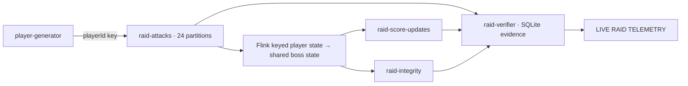

# live-raid-streaming-demo

**Kafka records every action. Flink computes live state. Kubernetes recovers workers. The verifier proves the scoreboard stayed correct.**

Thousands of simulated players share one raid boss. Watch throughput, committed-stream latency, recovery and a stateful rules upgrade at **LIVE RAID TELEMETRY**. The same open-source workloads deploy by script to local or remote Kubernetes. K3s through k3d is the local validation baseline.

## Open the live dashboard

**Browser URL: [http://localhost:18080](http://localhost:18080)** after starting this command from the repository root:

```bash
export KUBE_CONTEXT=k3d-live-raid
./scripts/open-dashboard.sh
```

Keep that terminal open. The default browser port is **18080**; containers and Kubernetes Services use internal port 8080. To choose another local port, set `DASHBOARD_PORT` before running the script. If you use a separate kubeconfig, set `KUBECONFIG` too. For the development validation cluster created during this build:

```bash
KUBECONFIG=/tmp/raid-kubeconfig KUBE_CONTEXT=k3d-live-raid ./scripts/open-dashboard.sh
```

The dashboard is a running Kubernetes application, not a GitHub Pages site. Remote browser access uses the HTTPS deployment instructions below. Its page source is [`apps/raid-dashboard/index.html`](apps/raid-dashboard/index.html).

After `./scripts/01-create-cluster.sh`, all demo scripts automatically load the generated `.runtime/kubeconfig` and `k3d-live-raid` context when `KUBE_CONTEXT` is unset. This deliberately overrides a machine-wide inherited `KUBECONFIG`, which is common on K3s hosts. For an existing Kubernetes cluster, set both `KUBECONFIG` and `KUBE_CONTEXT`; the named context takes precedence.

This is a purpose-built audience dashboard: a live pipeline diagram, five selectable presentation phases, throughput trend, boss HP, player leaderboard, latency, Kafka lag, Flink workers and the final integrity verdict. Select a phase to display its explanation; execute the corresponding terminal script to change the live workload. Use [k9s](k9s/README.md) beside it to show Kubernetes recovery. No Grafana installation is required.

[View the dashboard screenshot](docs/dashboard.png) captured from the validated local cluster.

Version: **0.1**. Local K3s validation **passed with 552,902 matching attacks, zero duplicates and zero missing events**, including worker recovery and the v1 → v2 savepoint upgrade. See the [validation record](docs/validation.md) for evidence and tested boundaries.

## Prerequisites

Install [Docker Engine](https://docs.docker.com/engine/install/), [kubectl](https://kubernetes.io/docs/tasks/tools/), [Helm](https://helm.sh/docs/intro/install/), [k3d](https://k3d.io/stable/#installation), Python 3 and curl. Docker must be running and accessible to your user. No local Java, Maven, Node or Python packages are needed to run the demo; builds happen in containers.

`k3d` is the client program that creates and manages K3s containers; a running `k3d-*` Docker container does not install that program on your shell `PATH`. On the first local run, `00-check-prereqs.sh` downloads the pinned v5.8.3 binary to ignored `.tools/k3d/k3d`, verifies the upstream release checksum, and later scripts use it automatically. Install it separately with `./scripts/install-k3d.sh`. The scripts resolve `K3D_BIN`, then `.tools/k3d/k3d`, then `PATH`, so `export K3D_BIN=/absolute/path/to/k3d` still overrides the project tool.

Recommended laptop: 8 CPU threads, 16 GiB RAM, at least 25 GiB free disk. Allocate Docker at least 10 GiB RAM. Initial image downloads need internet and can take several minutes. The default single K3s node is capped at 10 GiB; override with `CLUSTER_MEMORY=12g ./scripts/01-create-cluster.sh`. On smaller machines use `HIGH_REPLICAS=4 ./scripts/phase-2-scale-load.sh`. A full run should take 10–20 minutes after installation; stop load after presenting to avoid filling local volumes.

Pinned components: K3s v1.31.6, Strimzi 0.46.0 / Apache Kafka 4.0.0 (KRaft), Apache Flink Kubernetes Operator 1.11.0, Flink 1.20.1 / Kafka connector 3.3.0-1.20, kafka-python 2.3.0, Python 3.12. These are a reproducible demo baseline, not a claim to use the newest releases.

## Quickstart

```bash
git clone https://github.com/filipejbgomes/live-raid-streaming-demo.git
cd live-raid-streaming-demo
./scripts/00-check-prereqs.sh
./scripts/01-create-cluster.sh
export KUBE_CONTEXT=k3d-live-raid
./scripts/02-install-operators.sh
./scripts/03-deploy-kafka.sh
./scripts/04-build-images.sh
./scripts/05-deploy-demo.sh
./scripts/open-dashboard.sh
```

Open http://localhost:18080. Keep the port-forward terminal running. In a second terminal, from the repository root:

```bash
./scripts/phase-1-baseline.sh
./scripts/phase-2-scale-load.sh
./scripts/phase-3-kill-worker.sh
./scripts/phase-4-upgrade-job.sh
./scripts/phase-5-final-proof.sh
```

Each phase prints presenter notes and pauses for Enter. Phase 5 stops generation, waits for three stable matched snapshots, prints a proof table and writes `reports/final-proof.json`. A timeout, empty input, unavailable telemetry or mismatch exits nonzero. It never prints PASS on an empty raid.

## Deploy to an existing Kubernetes cluster

The deployment path has no k3d dependency. It needs a Kubernetes API supported by the pinned operators, DNS, dynamic ReadWriteOnce storage (a default StorageClass or `STORAGE_CLASS`), permission to install CRDs/operators and create the dedicated `kafka`, `flink`, `demo`, `observability` namespaces, and nodes able to pull the images. Admission policies may require site-specific security settings. This is portable Kubernetes packaging, not a claim of testing every distribution or API version.

Build and publish from a workstation with Docker, using a registry you control. Replace the example registry and context with yours:

```bash
export IMAGE_REGISTRY=registry.example.org/team/live-raid
export IMAGE_TAG=demo-1
# Authenticate Docker to your registry before publishing.
./scripts/04-build-images.sh push
export KUBE_CONTEXT=my-kubernetes-context
# Optional; omit to use the cluster's default StorageClass:
export STORAGE_CLASS=my-storage-class
./scripts/deploy.sh
./scripts/open-dashboard.sh
```

Port-forwarding works against remote Kubernetes too. Keep these environment settings for all phase scripts, particularly phase 4. Use unique image tags for each build; reused tags can leave cached images on nodes. If nodes use a different CPU architecture, set `PLATFORMS=linux/amd64,linux/arm64` with a configured Docker buildx builder when running the `push` command. The local build/import path uses the workstation's architecture.

For a private registry, create an image pull secret in both `demo` and `flink` namespaces and set `IMAGE_PULL_SECRET` to its name before deployment. The secret must exist in each namespace; credentials are never stored in the repository. All five app images are rewritten consistently, including the upgrade to v2. Operator and upstream images still need to be reachable by the cluster.

For external HTTPS, cert-manager provisions and renews a Let's Encrypt certificate. HTTP-01 requires a public DNS hostname resolving to the ingress address and inbound ports 80 and 443. No domain or email is hard-coded:

```bash
export DASHBOARD_HOST=raid.example.org
export ACME_EMAIL=operator@example.org
export INGRESS_CLASS=traefik   # your existing controller's class
export ACME_ENV=staging       # first verify HTTP-01 routing; certificate is untrusted
./scripts/expose-dashboard.sh ingress
export ACME_ENV=production
./scripts/expose-dashboard.sh ingress
```

If the cluster needs an ingress controller too, `loadbalancer` installs a dedicated Traefik controller whose Service is type LoadBalancer, then configures the same HTTPS Ingress:

```bash
export DASHBOARD_HOST=raid.example.org
export ACME_EMAIL=operator@example.org
export ACME_ENV=production
./scripts/expose-dashboard.sh loadbalancer
```

Point the DNS name at the displayed controller address. If DNS is not ready, certificate issuance times out visibly; fix DNS and rerun. The application Service remains internal. `DASHBOARD_ACCESS=ingress` or `loadbalancer` integrates this step with `deploy.sh`. You may instead use `TLS_MODE=existing TLS_SECRET=my-tls-secret ./scripts/expose-dashboard.sh ingress` with a certificate Secret already present in `demo`.

The scripts install cert-manager v1.17.4 only when its CRD is absent, otherwise reuse the cluster's installation. A namespaced Issuer separates this demo's ACME account from other workloads. Certificates rotate automatically; the ingress controller reloads the renewed Secret. External HTTP dashboard requests redirect to HTTPS; ACME challenge requests are routed separately by cert-manager. Default ACME environment is production; staging is recommended for the first DNS test. Local `port-forward` needs no public domain or certificate.

See [TLS runbook](docs/tls.md) for DNS prerequisites, renewal inspection and troubleshooting.

`STORAGE_CLASS` is resolved before initial PVC creation; changing it later does not migrate existing volumes. Inspect rendered configuration without deployment:

```bash
python3 scripts/render.py k8s/flink/job.yaml k8s/demo/verifier.yaml
```

## Data flow and correctness



An event carries `eventId`, `playerId`, `sequence`, `damage`, `createdAtEpochMs`, `generatorId`. IDs have the form `<playerId>:attack-00000456`. Each generator incarnation owns unique players; each player starts at sequence 1. A restarted generator introduces new players instead of reusing old sequence numbers. Idempotent, acknowledged production preserves per-player ordering. The proof's expected set is **events durably received by Kafka**, not unacknowledged actions attempted by a failed process.

Flink maintains last sequence, cumulative damage and combo in keyed state. Invalid sequences emit explicit invalid evidence with zero applied damage. A single downstream boss key maintains HP, attack count, damage and invalid count. This deliberate global aggregation is a throughput bottleneck suitable for a laptop, not an unlimited-scale architecture. v1 applies raw damage; v2 doubles every tenth valid attack. Both builds use identical state descriptors and stable operator UIDs, including the source and sinks.

Checkpoints run every 5 seconds. Two transactional Kafka sinks publish score and integrity records; the verifier reads only committed transactions. The sinks commit independently, so temporary inter-topic skew is expected. Flink HA metadata, checkpoints and savepoints use the bundled MinIO S3-compatible object store, reachable from every worker node. MinIO and the verifier each use their own ordinary ReadWriteOnce PVC; Flink workers do not require a shared filesystem. Phase 4 suspends using savepoint mode, checks that a savepoint exists, then resumes with the v2 image; fallback to last-state upgrades is disabled.

The verifier stores per-topic event identities and source offsets atomically in SQLite. Restarting it resumes without counting its own replay as output duplicates. It independently compares the exact event ID sets, SHA-256 hashes of canonical input fields, expected damage under the reported version, input sequence gaps, invalid events, score/integrity payload agreement and aggregate totals. Duplicate IDs at different Kafka offsets fail the proof. `/reset` replays retained Kafka history; it cannot turn missing retained history into a PASS.

`GET /metrics-json`, `GET /health`, `POST /reset` are available on the verifier service:

```bash
kubectl -n demo port-forward service/raid-verifier 18081:8080
# In another terminal:
curl -fsS http://localhost:18081/metrics-json
curl -fsS -X POST http://localhost:18081/reset
```

Live missing counts include in-flight events. Latency is observed input-creation-to-committed-output time (last 10,000 observations), so the checkpoint interval contributes seconds. Kafka lag uses Flink's checkpoint-committed source offsets. Worker count comes from Kubernetes Ready pods; recovery timeline records observed job and pod-set changes every 5 seconds. Unavailable telemetry is displayed as unavailable. Players online means seen in the last 30 seconds; attacks/sec uses a 10-second window.

## Scope and storage

The default one-broker, one-object-store topology tolerates a TaskManager failure, **not loss of the storage backing the broker or object store**. K3s uses local-path volumes; remote clusters can use their configured CSI storage. Dashboard access defaults to localhost port-forwarding. Scripted Ingress and LoadBalancer access are available; use an existing ingress controller or install the scripted Traefik controller, with certificates managed by cert-manager. Authentication is outside this demo. The proof is an integrity demonstration under the configured failure experiment, not a mathematical proof of arbitrary failures or an independent audit of malicious producers. Version is reported by the job; verify the v2 image and savepoint in the runbook too.

Kafka retains 24 hours of history; evidence grows with event count. The verifier rejects replay if history was truncated. Keep all phases within a short session. PVCs are 10 GiB Kafka, 5 GiB object storage, 5 GiB verifier; K3s local-path sizes may not enforce hard filesystem quotas. Clean the cluster for a fresh raid rather than deploying v1 over an existing v2 raid.

```bash
./scripts/cleanup.sh             # remove workloads, retain logs/evidence
./scripts/cleanup.sh --cluster   # delete the dedicated cluster and its local data
./scripts/reset-demo.sh          # rebuild all demo namespaces and data; keep the K3s image cache
./scripts/reset-demo.sh --cluster # also recreate the K3s node and its image cache
```

`reset-demo.sh` is the presenter reset: it removes and recreates the demo namespaces, operators, Kafka, storage and workloads while retaining the local K3s node and its pulled image cache. Kafka records, checkpoints, verifier evidence and demo pods are new, so the relevant k9s views begin with zero pod restarts. `reset-demo.sh --cluster` additionally recreates the named local K3s node when a full infrastructure wipe is required. Neither mode targets an existing remote Kubernetes cluster.

## Terminal observability with k9s

```bash
./k9s/install.sh
./k9s/open.sh
```

The separate [k9s folder](k9s/README.md) includes a pinned installer, isolated configuration, resource hotkeys and live verifier/checkpoint/TLS plugins. It follows `KUBE_CONTEXT` and starts in read-only mode. Keep it beside the browser dashboard during recovery and upgrade phases.

## Validation and troubleshooting

```bash
python3 -m unittest discover -s tests -v
kubectl -n kafka get kafka,kafkanodepool,kafkatopic
kubectl -n flink get flinkdeployment,pods,pvc
kubectl -n flink describe flinkdeployment raid-score-engine
kubectl -n flink logs deployment/flink-kubernetes-operator --tail=100
kubectl -n demo logs deployment/raid-verifier --tail=100
kubectl get events -A --sort-by=.lastTimestamp
```

See [runbook](docs/demo-runbook.md), [presentation outline](docs/presentation-outline.md), [troubleshooting](docs/troubleshooting.md) and [validation record](docs/validation.md).

Configuration references: [Strimzi 0.46 deployment guide](https://strimzi.io/docs/operators/0.46.0/deploying), [Flink Kafka source/sink semantics](https://nightlies.apache.org/flink/flink-docs-release-1.20/docs/connectors/datastream/kafka/), [Flink Operator job management](https://nightlies.apache.org/flink/flink-kubernetes-operator-docs-release-1.11/docs/custom-resource/job-management/), [kafka-python producer configuration](https://kafka-python.readthedocs.io/en/2.3.0/apidoc/KafkaProducer.html).
